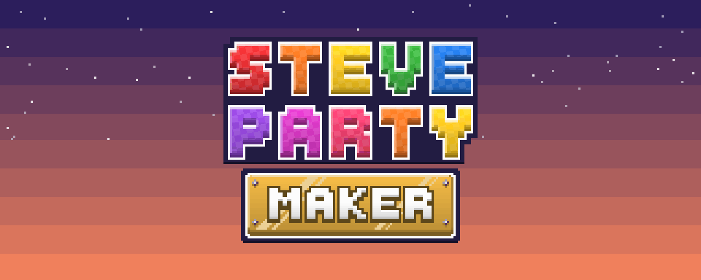

  <b>A party board game built inside Minecraft.</b> 
  Build a board block by block, roll the dice, move your pawns, play mini-games and collect stars, in survival.

  <a href="https://github.com/yannicksuc/SteveParty/wiki">Wiki (French)</a> ·
  <a href="#installation">Installation</a> ·
  <a href="#development">Development</a>

---

## What it is

SteveParty turns Minecraft into a party board game. Everything is a block or an item you craft in survival:
you lay out the board, turn any mob into a pawn, and run the game from a Party Controller. Redstone can drive
almost every part of it.

## Features

**The board**
- **Board spaces**: tiles in several sizes and slopes, waypoints and junctions, behaviours set with cartridges
  (move forward or back, teleport, shop, replay…), a wrench and a redstone router.
- **Pawns**: any mob becomes a pawn with the Tokenizer Wand. Store a pawn in a token and set it down again.
- **Party Controller**: sets the turn order and the program of each turn. Players roll the dice, move their pawns
  and earn coins and stars. A HUD shows the turn strip and the score table.
- **Dice**: single, double and triple dice. The Dice Forge lets you carve your own faces and forge custom dice.
- **Finish pole and podiums**: jump to the top of the flag pole to score, then rank the players on the podiums.

**Mini-games**
- **Mini-game pages** describe a mini-game: its zone, its formats (teams of 2 to 4 sides, free-for-all or
  everyone together) and the pipes that bring the players in and take them out.
- **Mini-game Controller**: practice rounds first, then the real round starts once every player has voted ready.
- **Protected zone**: during a round, each player has an inventory that exists only for the round, and the zone is
  sealed. Every change made in the zone is recorded and undone afterwards.

**Shops and the Mula**
- **Shops**: stall, cash register and shopkeeper key, plus the Boxed Trader that sells your shop's offers.
- **Mula**: a small flying star creature that grows, dances around the Dice Forge and falls from the sky during
  shooting-star nights. Use the Telescope to find it.

**Decoration**
- Toy-like plastic blocks in 16 colours, plastic and glass pipes you travel through, stencils to paint or engrave
  patterns, and polished, bevelled and checkered building blocks.

The [wiki](https://github.com/yannicksuc/SteveParty/wiki) (in French) documents every block, item and recipe.

## Installation

| | Version |
|---|---|
| Minecraft | **1.21.1** (Java 21) |
| [Fabric Loader](https://fabricmc.net/use/) | 0.16.9 or later |
| [Fabric API](https://modrinth.com/mod/fabric-api) | 0.116.17+1.21.1 |
| [GeckoLib](https://modrinth.com/mod/geckolib) | 4.7.3 or later (Fabric 1.21.1) |
| Recommended: [REI](https://modrinth.com/mod/rei) | to read the recipes in game |

1. Install Fabric Loader for Minecraft 1.21.1.
2. Put Fabric API, GeckoLib and the SteveParty `.jar` in your `mods/` folder.
3. Launch the Fabric profile. All the items are in the **Steve Party** creative tab.

Server options (mini-game zone limits, forbidden blocks, Mula spawn sites…) live in `config/steveparty.json`.
See the [Développement](https://github.com/yannicksuc/SteveParty/wiki/Developpement#configuration-du-serveur) page of the wiki.

## Development

Requires JDK 21. Everything goes through the Gradle wrapper.

| Command | Effect |
|---|---|
| `./gradlew build` | builds the mod into `build/libs/steveparty-0.1-SNAPSHOT.jar` |
| `./gradlew runGametest` | runs the in-game test suite (Fabric GameTest) on a dedicated server |
| `./gradlew runDatagen` | regenerates `src/main/generated` (recipes, models, loot tables, tags) |
| `./gradlew runClient` | starts a dev client |
| `.\scripts\dev.ps1 up` | starts a dev server, then a client that joins it (Windows) |

Demo board, test world and the dev server scripts are described on the
[Développement](https://github.com/yannicksuc/SteveParty/wiki/Developpement) wiki page.

Stack: Fabric 1.21.1 (Yarn mappings), Architectury, GeckoLib 4.7.3, Java 21. Package `fr.lordfinn.steveparty`.

### Releasing

Push a tag `vX.Y.Z` (or `vX.Y.Z-beta.N` / `vX.Y.Z-alpha.N`) to build and publish that version on Modrinth and
CurseForge; the tag sets the version. The one-time setup (repo variables and tokens) is described at the top of
[`.github/workflows/release.yml`](.github/workflows/release.yml). The store description lives in
`docs/store-listing.md` and is pushed to Modrinth when it changes on `master` (CurseForge: paste it by hand).
`scripts/delete-release-version.ps1` removes a published Modrinth version.

## License

Copyright (c) 2024-2026 LordFinn. All rights reserved.

SteveParty is not open source: you may not copy, modify, redistribute or publish this code or its assets, in
whole or in part, without the author's prior written permission. See [LICENSE.txt](LICENSE.txt).

Bug reports and ideas are welcome in the [issues](https://github.com/yannicksuc/SteveParty/issues).
